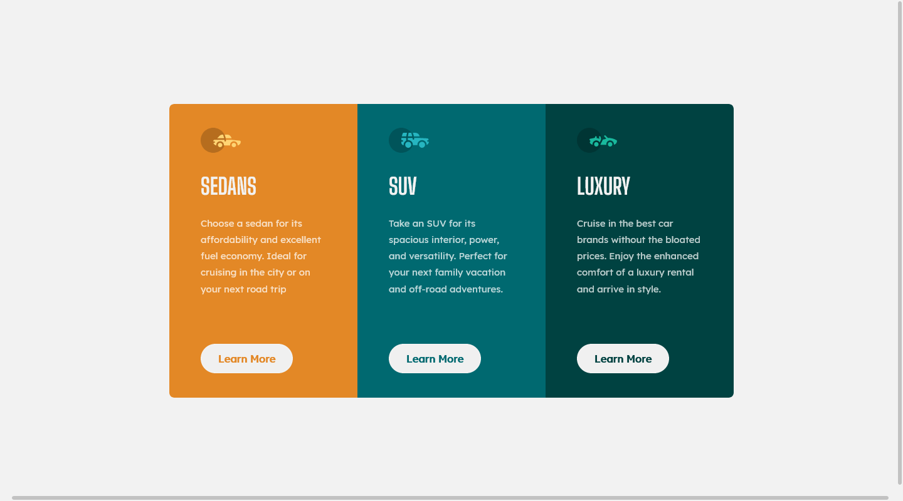
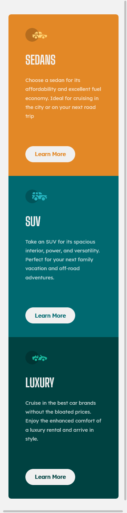

# Frontend Mentor - 3-column preview card component

This is a solution to the [3-column preview card component](https://www.frontendmentor.io/challenges/3column-preview-card-component-pH92eAR2-). Frontend Mentor challenges help you improve your coding skills by building realistic projects.

## Table of contents

- [Overview](#overview)
  - [The challenge](#the-challenge)
  - [Screenshot](#screenshot)
  - [Links](#links)
- [My process](#my-process)
  - [Built with](#built-with)
  - [What I learned](#what-i-learned)
- [Author](#author)

## Overview

### The challenge

Users should be able to:

- View the optimal layout for the site depending on their device's screen size

### Screenshot

<!-- 1440 / 800 -->
<!-- 375 / 1592 -->

### Links

- Live Site URL: [Live Site URL:](https://practical-banach-29de1b.netlify.app/)
- Solution URL: [Solution URL:](https://www.frontendmentor.io/solutions/3column-preview-card-component-html-css-Z6-9PHUux)

## My process

### Built with

- Semantic HTML5 markup
- CSS custom properties
- Flex box

### What I learned

I learned how to use max-width and max-height more wisely, since I didn't know their big role to make my design responsive in a good way

## Author

<!-- - Website -  -->
- Frontend Mentor - [@Rezzak](https://www.frontendmentor.io/profile/errazakallah31)
- Twitter - [@Rezzak_48](https://twitter.com/Rezzak_48)
